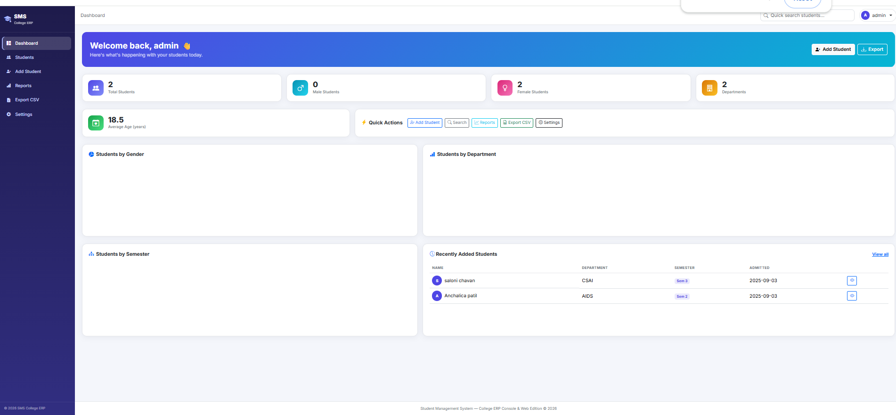

# 🎓 Student Management System

A modern **College ERP Student Management System** built using **Python, Flask, SQLite, Bootstrap 5, HTML, CSS, and JavaScript**.

The project includes both a **Console Edition** and a **Web Edition**, sharing the same SQLite database.

---

## ✨ Features

### Web Edition
- 🔐 Secure Admin Login
- 📊 Dashboard with Statistics
- 👨‍🎓 Student Management (CRUD)
- 🔍 Live Search & Filters
- 📈 Reports & Analytics
- 📤 Export Student Data to CSV
- ⚙️ Admin Settings
- 🖼️ Student Photo Upload
- 📱 Responsive Bootstrap UI

### Console Edition
- Add Student
- View Students
- Search Student
- Update Student
- Delete Student
- Count Students

---

# 🛠 Tech Stack

- Python
- Flask
- SQLite
- SQLAlchemy
- Bootstrap 5
- HTML5
- CSS3
- JavaScript

---

# 📂 Project Structure

```text
Student-Management-System/
│
├── app.py
├── main.py
├── database.py
├── auth.py
├── dashboard.py
├── add_student.py
├── search_student.py
├── update_student.py
├── delete_student.py
├── export_data.py
├── requirements.txt
├── students.db
│
├── static/
├── templates/
├── uploads/
│
└── screenshots/
    ├── Login page.png
    ├── Dashboard.png
    ├── Student List.png
    ├── Add Student form.png
    ├── Reports page.png
    └── settings.png
```

---

# 🚀 Installation

Clone the repository

```bash
git clone https://github.com/anchalicapatil2007-cell/Student-Management-System.git
```

Open the project

```bash
cd Student-Management-System
```

Install dependencies

```bash
pip install -r requirements.txt
```

Run the web application

```bash
python app.py
```

Open your browser

```
http://127.0.0.1:5000
```

---

# 🔑 Default Login

Username

```
admin
```

Password

```
admin123
```

---

# 📸 Screenshots

## Login Page


---

## Dashboard



---

## Student List


---

## Add Student Form


---

## Reports


---

## Settings


---

# 📊 Modules

- Authentication
- Dashboard
- Student Management
- Search & Filter
- Reports
- Export CSV
- Settings
- Database Backup

---

# 💾 Database

SQLite database

```
students.db
```

---

# 📄 License

This project is developed for educational purposes.

---

# 👩‍💻 Author

**Anchalica Shital Patil**

Second Year B.Tech (Artificial Intelligence & Data Science)

Vishwakarma Institute of Technology (VIT), Pune

GitHub:
https://github.com/anchalicapatil2007-cell
