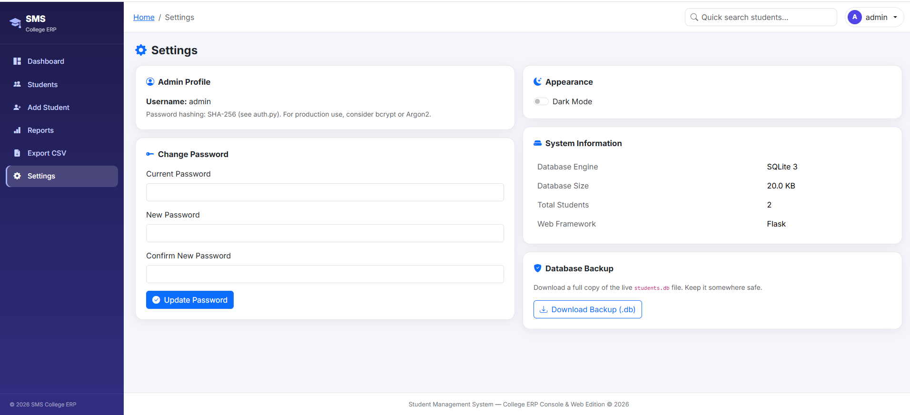

# 🎓 Student Management System

A modern **Student Management System** built with **Python**, **Flask**, and **SQLite**. The project includes both a **Console Edition** and a **Web Edition**, sharing the same database and business logic for efficient and modular development.

---

## ✨ Features

- 🔐 Secure Admin Login
- 👨‍🎓 Student CRUD Operations
- 📊 Interactive Dashboard
- 🔍 Search & Filter Students
- 📁 CSV Export
- 📸 Student Photo Upload
- 📈 Reports & Analytics
- 🌙 Dark Mode Support
- 📱 Responsive Bootstrap 5 UI
- 🔒 SHA-256 Password Hashing

---

## 📸 Screenshots

### 🔐 Login Page


### 📊 Dashboard


### 👨‍🎓 Student Management


### ➕ Add Student


### 📈 Reports


### ⚙️ Settings


---

## 🛠️ Technologies Used

- **Frontend:** HTML5, CSS3, Bootstrap 5, JavaScript
- **Backend:** Python, Flask
- **Database:** SQLite
- **Charts:** Chart.js
- **Authentication:** SHA-256 Password Hashing
- **IDE:** Visual Studio Code

---

## 📂 Project Structure

```
Student-Management-System/
│
├── app.py
├── main.py
├── database.py
├── auth.py
├── templates/
├── static/
├── requirements.txt
└── README.md
```

---

## 🚀 Installation

Clone the repository:

```bash
git clone https://github.com/anchalicapatil2007-cell/Student-Management-System.git
cd Student-Management-System
```

Install dependencies:

```bash
pip install -r requirements.txt
```

Run the application:

```bash
python app.py
```

Open your browser:

```
http://127.0.0.1:5000
```

---

## 🔑 Default Login

| Username | Password |
|----------|----------|
| admin | admin123 |

> **Note:** Change the default password after your first login.

---

## 📊 Key Modules

- Authentication
- Student Management (CRUD)
- Dashboard & Analytics
- Reports
- CSV Export
- Password Management

---

## 🚀 Future Enhancements

- Email Notifications
- PDF Report Generation
- Excel Import/Export
- REST API
- Docker Support
- PostgreSQL Integration
- Role-Based Access Control

---

## 👩‍💻 Author

**Anchalica Shital Patil**

Second-Year B.Tech (AI & Data Science)

---

## ⭐ Support

If you found this project useful, consider giving it a ⭐ on GitHub!
